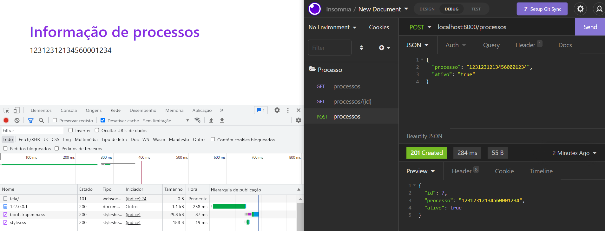

# django-rest-channels

Vamos montar uma aplicação que utiliza um api rest e devolve informações via websocket utilizando channels django django-rest-framework, montado em devcontainer com Python3.10 um app web que recebe atualizacoes da api rest via html e chamadas via backend rest

para o uso é necessário:  
- [x] pré requisitos
    - [x] docker - Docker version 20.10.8, build 3967b7d
    - [x] docker-compose - Docker Compose version v2.2.2
    - [x] visual studio
    - [x] extensions: Remote - Containers
    - [x] [documentação](https://code.visualstudio.com/docs/remote/containers)

## Get Started

Download do projeto via git API end APP 

```bash
#terminal 1
cd /app
./manager runserver

# faça requisição via apis rest , e o resultado vem na pagina da WEB
http://localhost:8000

```

## Roteiro de implementação 

- [x] criação do devcontainer
- [x] docker-compose configurando e orquestrando dockers de dependencias
- [x] instalando plugins do vscode para ajudar no desenvolviemnto
- [x] instalação do Django e suas dependencias
- [x] instalando e configurando rest_framework e suas configurações
- [x] instalando channels e configurando websocket com filas de mensagens 
- [x] configuraçõ de tarefas , gravação em banco de dados ,ORM django
- [x] base de dados com sqllite e gravação e retorno via websocket

## Ajudas e curiosidades

Implementação do django rest framework com serializer

## Referencias

 - https://getbootstrap.com/
 - https://docs.djangoproject.com/en/4.0/
 - https://www.django-rest-framework.org/
 - https://channels.readthedocs.io/en/stable/

 
 
